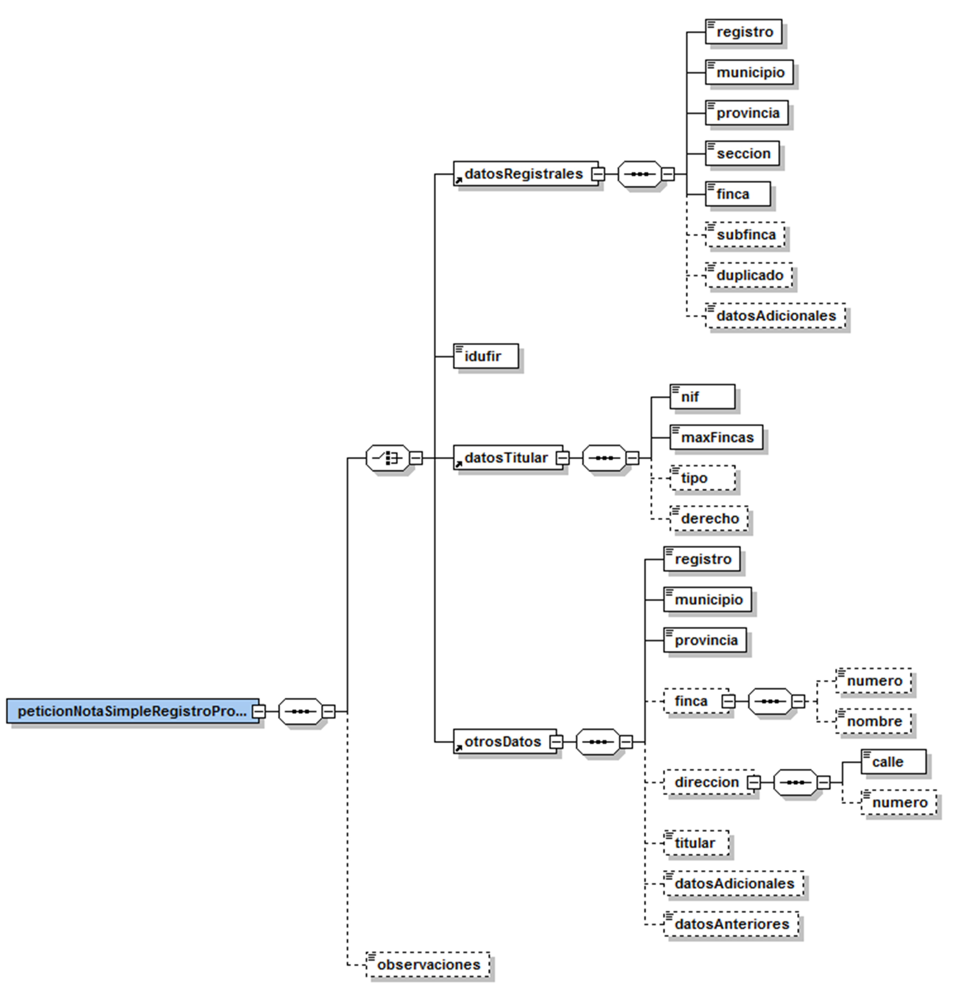
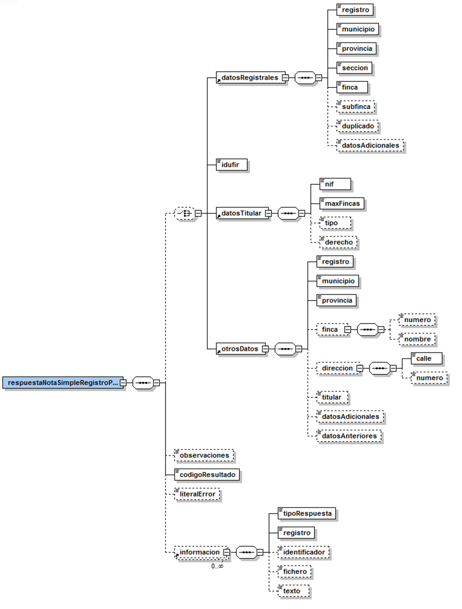
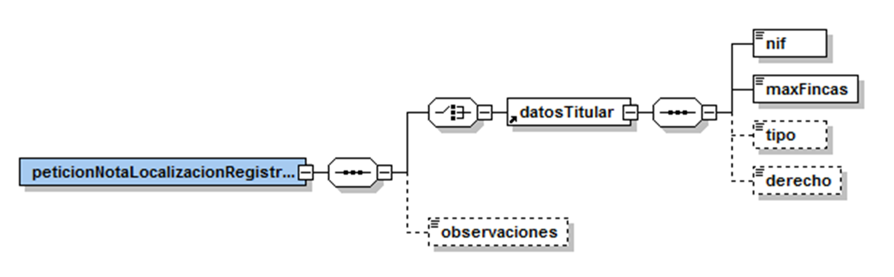
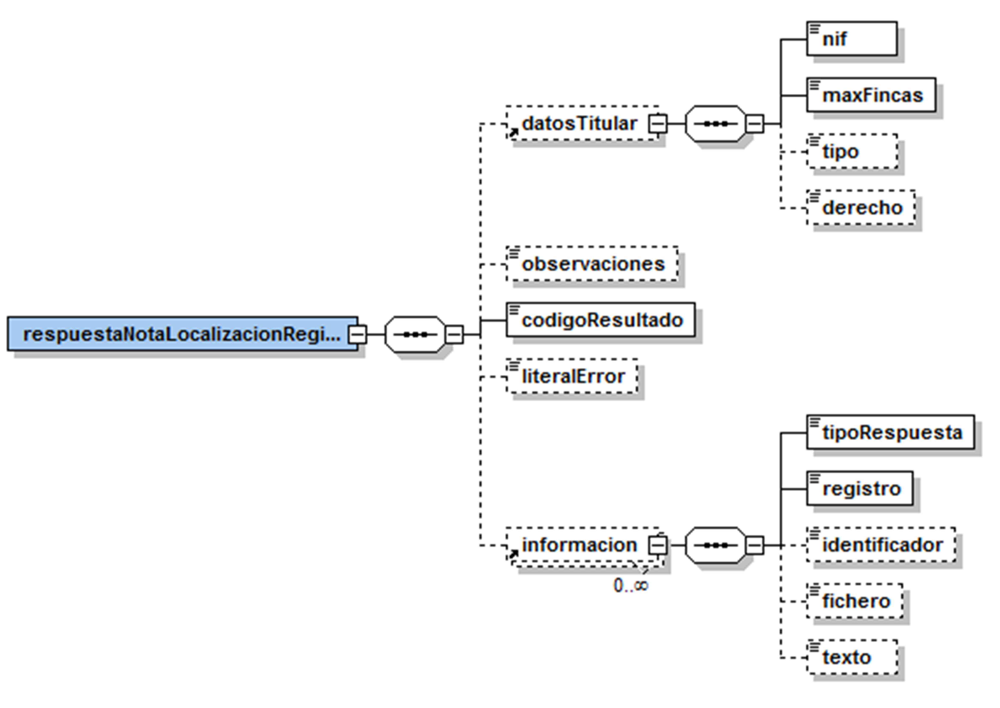

# VO-CORPME-REGISTRE_PROPIETAT Document d&#39;integració del servei

# **Via Oberta – Registre de la Propietat**


**Històric de revisions**

| **Versió** | **Data** | **Autor** | **Comentaris** |
| --- | --- | --- | --- |
| V1.0 | 05/09/2008 | Roger Noguera Arnau | Creació del document |
| V1.1 | 18/03/2009 | Roger Noguera Arnau | Ampliació joc de proves |
| V1.2 | 04/05/2009 | Roger Noguera Arnau | Missatge de resposta incorpora l&#39;element _identificador_. |
| V1.3 | 22/06/2009 | Roger Noguera Arnau | Dades genèriques de la petició. |
| V1.4 | 13/10/2009 | Roger Noguera Arnau | Restricció introduïda pel CORPME pel camp _observaciones_. |
| V2.0 | 02/09/2010 | Roger Noguera Arnau | Suport a consultes per altres dades. |


# 1 Introducció

Aquest document detalla la missatgeria associada al servei del Registre de la Propietat.

Per poder realitzar la integració cal conèixer prèviament la següent documentació:

- Document del Servei Via Oberta.
- [Document de Missatgeria Genèrica de la PCI del Consorci AOC.][PCI]

[PCI]:https://github.com/ConsorciAOC/PCI


# 2 Transmissions de dades disponibles

Les dades disponibles a través del servei són les que es presenten a continuació:

| **EMISSOR** |
| --- |
| CORPME (Colegio de Registradores de la Propiedad y Mercantiles de España) |

| **PRODUCTE** | **MODALITAT** | **DESCRIPCIO** |
| --- | --- | --- |
| **REGISTRE\_PROPIETAT** | NOTA\_SIMPLE | Nota simple. |
| NOTA\_LOCALITZACIO | Nota de localització. |

---
 Les modalitats de consum del _Colegio de Registradores de la Propiedad y Mercantiles_ es serveixen exclusivament pel frontal asíncron però NO s&#39;accepten lots de sol·licituds. 

---

# 3 Missatgeria dels serveis

A continuació es detalla la missatgeria corresponent al bloc de dades específiques de les modalitats de consum del producte REGISTRE\_PROPIETAT.

## 3.1 ota simple (NOTA\_SIMPLE)

### 3.1.1 Petició – dades genèriques

| _Element_ | _Descripció_ |
| --- | --- |
| Peticion/Atributos/IdSolicitanteOriginal | Codi de requeridor autoritzat al CORPME emprat a efectes de facturació (en la majoria de casos coincidirà amb el valor de l&#39;element *IdentificadorSolicitante* i només serà diferent per aquells requeridors amb jerarquia de departaments que impliqui facturació independent). |

### 3.1.2 Petició – dades específiques

Per obtenir una nota simple, cal informar de manera obligatòria una de les següents dades:

- Dades registrals de la finca.
- Codi IDUFIR.
- Dades del titular.
- Altres dades.

| _Element_ | _Descripció_ |
| --- | --- |
| peticionNotaSimpleRegistroPropiedad/datosRegistrales | Bloc de dades registrals de la finca. |
| peticionNotaSimpleRegistroPropiedad/idufir | Codi IDUFIR. |
| peticionNotaSimpleRegistroPropiedad/datosTitular | Bloc de dades del titular. |
| peticionNotaSimpleRegistroPropiedad/otrosDatos | Bloc de d&#39;altres dades. |
| peticionNotaSimpleRegistroPropiedad/observaciones | Text lliure. Opcional. Només aplica a consulta per dades registrals. |
| //datosRegistrales/registro | Codi de registre (codificació registradores). |
| //datosRegistrales/municipio | Codi de municipi (codificació registradores). |
| //datosRegistrales/provincia | Codi de provincia (codificació registradores). |
| //datosRegistrales/seccion | Codi de secció (codificació registradores). |
| //datosRegistrales/finca | Finca. |
| //datosRegistrales/subfinca | Subfinca (opcional). |
| //datosRegistrales/duplicado | Duplicat (opcional). |
| //datosRegistrales/datosAdicionales | Opcional. Permet informar dades addicionals que facilitin la localització de la informació (tom, foli, etc.). |
| //datosTitular/nif | NIF del titular (amb o sense lletra). |
| //datosTitular/maxFincas | Número màxim de finques la informació de les quals es proporcionarà. |
| //datosTitular/tipo | Tipus de finca (1: vivenda,2: altres, 0: tots). Opcional. Si no s&#39;informa la cerca no es restringeix per tipus de finca (equivalent a 0). |
| //datosTitular/derecho | Dret (1: ple dret, 2: altres, 0: tots). Opcional. Si no s&#39;informa la cerca no es restringeix per dret (equivalent a 0). |
| //otrosDatos/registro | Codi de registre (codificació registradores). |
| //otrosDatos/municipio | Codi de municipi (codificació registradores). |
| //otrosDatos/provincia | Codi de provincia (codificació registradores). |
| //otrosDatos/finca/numero | Número de finca en el registre. |
| //otrosDatos/finca/nombre | Nom de la finca. |
| //otrosDatos/direccion/calle | Adreça / nom del carrer. |
| //otrosDatos/direccion/numero | Adreça / número. |
| //otrosDatos/titular | Nom del titular actual o anterior de la finca. |
| //otrosDatos/datosAdicionales | Dades addicionals (text lliure) que ajudin a la localització de la finca. |
| //otrosDatos/datosAnteriores | Dades registrals anteriors (text lliure). |



---
 El camp observaciones només aplica a la consulta per dades registrals. Així, per exemple, és incorrecte fer una consulta per titular indicant a les observacions la finca concreta que es vol obtenir. 

---

 En cas de cerca per otrosDatos cal informar com a mínim els codis de registre, provincia i municipi. Addicionalment, es pot aportar les següents dades –totes elles opcionals- però com a mínim un d&#39;ells ha d&#39;estar present:

- Número de la finca en el registre, si es coneix.
- Nom de la finca si en té i es coneix.
- Adreça (carrer i número) si es coneix. No es pot proporcionar un número sense carrer però sí un carrer sense número.
- Nom del titular actual o anterior de la finca si es coneix.
- Dades addicionals (text lliure) que ajudin a la localització de la finca.
- Dades registrals anteriors (text lliure) si es coneixen.

---

### 3.1.3 Resposta – dades específiques

| _Element_ | _Descripció_ |
| --- | --- |
| respuestaNotaSimpleRegistroPropiedad/datosRegistrales | Bloc de dades registrals de la finca informat a la petició. |
| respuestaNotaSimpleRegistroPropiedad/idufir | Codi IDUFIR informat a la petició. |
| respuestaNotaSimpleRegistroPropiedad/datosTitular | Bloc de dades del titular informat a la petició. |
| respuestaNotaSimpleRegistroPropiedad/otrosDatos | Bloc de d&#39;altres dades informat a la petició. |
| respuestaNotaSimpleRegistroPropiedad/observaciones | Text informat a la petició. |
| respuestaNotaSimpleRegistroPropiedad/codigoResultado | 0: consulta finalitzada correctament, 1: consulta finalitzada amb errors. |
| respuestaNotaSimpleRegistroPropiedad/literalError | Text informatiu en cas que la consulta finalitzi amb errors. |
| respuestaNotaSimpleRegistroPropiedad/informacion | Bloc que conté la resposta a la consulta realitzada. |
| //informacion/tipoRespuesta | Tipus de resposta (vegeu apartat 3.3 per més detalls). |
| //informacion/registro | Registre que ha generat la informació. |
| //informacion/identificador  | Referència / identificador de petició informat pel CORPME. |
| //informacion/fichero | Si es proporciona la informació sol·licitada conté els fitxers PDF codificats ens base 64. |
| //informacion/texto | Conté l&#39;explicació de l&#39;actuació si no es proporciona la informació sol·licitada. |



## 3.2 Nota de localización (NOTA\_LOCALITZACIO)

### 3.2.1 Petició – dades genèriques

| _Element_ | _Descripció_ |
| --- | --- |
| Peticion/Atributos/IdSolicitanteOriginal | Codi de requeridor autoritzat al CORPME emprat a efectes de facturació (en la majoria de casos coincidirà amb el valor de l&#39;element *IdentificadorSolicitante* i només serà diferent per aquells requeridors amb jerarquia de departaments que impliqui facturació independent). |


### 3.2.2 Petició – dades específiques

Anàlogament a les notes simples, per obtenir una nota de localització, cal informar de manera obligatòria les dades del titular.

- Dades del titular.

| _Element_ | _Descripció_ |
| --- | --- |
| peticionNotaLocalizacionRegistroPropiedad/datosTitular | Bloc de dades del titular. |
| peticionNotaLocalizacionRegistroPropiedad/observaciones | Text lliure. Opcional. |
| //datosTitular/nif | NIF del titular (amb o sense lletra). |
| //datosTitular/maxFincas | 0. Nota de localització retorna els registres de la propietat on el titular té propietats. |
| //datosTitular/tipo | Tipus de finca (1: vivenda,2: altres, 0: tots). Opcional. Si no s&#39;informa la cerca no es restringeix per tipus de finca (equivalent a 0). |
| //datosTitular/derecho | Dret (1: ple dret, 2: altres, 0: tots). Opcional. Si no s&#39;informa la cerca no es restringeix per dret (equivalent a 0). |



### 3.2.3 Resposta – dades específiques

| _Element_ | _Descripció_ |
| --- | --- |
| respuestaNotaLocalizacionRegistroPropiedad/datosTitular | Bloc de dades del titular informat a la petició. |
| respuestaNotaLocalizacionRegistroPropiedad/observaciones | Text informat a la petició. |
| respuestaNotaLocalizacionRegistroPropiedad/codigoResultado | 0: consulta finalitzada correctament, 1: consulta finalitzada amb errors. |
| respuestaNotaLocalizacionRegistroPropiedad/literalError | Text informatiu en cas que la consulta finalitzi amb errors. |
| respuestaNotaLocalizacionRegistroPropiedad/informacion | Bloc que conté la resposta a la consulta realitzada. |
| //informacion/tipoRespuesta | Tipus de resposta (vegeu apartat 3.3 per més detalls). |
| //informacion/registro | Registre que ha generat la informació. |
| //informacion/identificador  | Referència / identificador de petició informat pel CORPME. |
| //informacion/fichero | Si es proporciona la informació sol·licitada conté els fitxers PDF codificats ens base 64. |
| //informacion/texto | Conté l&#39;explicació de l&#39;actuació si no es proporciona la informació sol·licitada. |



## 3.3Tipus de resposta

A continuación es detallen els codis de tipus de respuesta:

| CODI  | DESCRIPCIÓ |
| --- | --- |
| 1 | Nota simple. |
| 2 | Nota simple negativa. |
| 3 | Nota de localització. |
| 20 | Denegació. |
| 21 | Denegació per inconsistència de dades (detectat quan un operador humà de l&#39;emisor final cerca la información sol·licitada). |
| 22 | Denegació per manca de dades (detectat quan un operador humà de l&#39;emisor final cerca la informació sol·licitada). |
| 23 | Denegació per múltiples titulars coincidents (únicament en notes de localització). |
| 24 | Denegació per finca inexistent. |
| 30 | Avís d&#39;enviament per canal alternatiu. La informació no viatja en el XML, sinó que es fa arribar al requeridor de manera alternativa manual (per exemple, via correu electrònic). |

# 4 Joc de proves

El _Colegio de Registradores de la Propiedad y Mercantiles de España_ (CORPME) respon manualment i sota demanda a les peticions de proves enviades contra el seu servei.

Per tal de no dependre de la disponibilitat de l&#39;emisor final a l&#39;hora d&#39;obtenir resposta a les peticions generades en fase d&#39;integració es disposa d&#39;un procés que les genera automàticament segons el valor de l&#39;identificador de sol·licitud informat en la petició:

| _ID SOL·LICITUD_ | _RESPOSTA GENERADA_ |
| --- | --- |
| 1 / Qualsevol ID | Nota simple. |
| 2 | Nota simple negativa. |
| 3 | Nota de localització. |
| 20 | Denegació. |
| 21 | Denegació per inconsistència de dades. |
| 22 | Denegació per manca de dades. |
| 23 | Denegació per múltiples titulars coincidents (notes de localització). |
| 24 | Denegació per finca inexistent. |
| 30 | Avís d&#39;enviament per canal alternatiu. |

Tot i la generació automatitzada de la resposta, les peticions que s&#39;envien contra la PCI es transmeten en primera instància al servei del CORPME que rep la petició i en valida la correctesa (per exemple codis de registre, municipis, format IDUFIR).

---
 El servei de proves del CORPME pot no estar disponible per les tardes a partir de les 18:30 – 19:00 degut a una aturada de manteniment la base de dades de l&#39;emisor final. 

---

## 4.1 Dades de prova

Les següents dades de prova han estat proporcionades pel CORPME per la consulta de notes simples:

- Codis IDUFIR: 28092000281196 / 28096000000016
- Titulars: 36277995A (1 finca) / 17707972L (4 fincas) / 00000666E (sujeto inexistente)
- Dades registrals (codi registre / número de finca): 29001 / 1, 28145 / 61144, 25007 / 726, 28053 / 19823

# Annex – exemple de missatges**

__Exemple petició__

```
<Peticion xmlns="http://gencat.net/scsp/esquemes/peticion">
	<Atributos>
		<IdPeticion>TEST_REGISTRADORS_000</IdPeticion>
		<NumElementos>1</NumElementos>
		<TimeStamp>2007-04-18 17:35:02.454</TimeStamp>
		<Estado>
			<CodigoEstado/>
			<CodigoEstadoSecundario/>
			<LiteralError/>
			<TiempoEstimadoRespuesta>0</TiempoEstimadoRespuesta>
		</Estado>
		<CodigoCertificado>NOTA_SIMPLE</CodigoCertificado>
		<CodigoProducto>REGISTRE_PROPIETAT</CodigoProducto>
		<DatosAutorizacion>
			<IdentificadorSolicitante>CAOC</IdentificadorSolicitante>
			<NombreSolicitante>CAOC</NombreSolicitante>
			<Finalidad>FINALITAT</Finalidad>
		</DatosAutorizacion>
		<Emisor>
			<NifEmisor>Q0801175A</NifEmisor>
			<NombreEmisor>CAOC</NombreEmisor>
		</Emisor>
		<IdSolicitanteOriginal>CAOC</IdSolicitanteOriginal>
		<NomSolicitanteOriginal>CAOC</NomSolicitanteOriginal>
		<Funcionario>
			<NombreCompletoFuncionario>FUNCIONARIO</NombreCompletoFuncionario>
			<NifFuncionario>NIF</NifFuncionario>
			<EMailFuncionario/>
		</Funcionario>
	</Atributos>
	<Solicitudes>
		<SolicitudTransmision>
			<DatosGenericos>
				<Emisor>
					<NifEmisor>Q0801175A</NifEmisor>
					<NombreEmisor>CAOC</NombreEmisor>
				</Emisor>
				<Solicitante>
					<IdentificadorSolicitante>CAOC</IdentificadorSolicitante>
					<NombreSolicitante>CAOC</NombreSolicitante>
					<Finalidad>FINALITAT</Finalidad>
					<Consentimiento>Si</Consentimiento>
					<Funcionario>
						<NombreCompletoFuncionario>FUNCIONARIO</NombreCompletoFuncionario>
						<NifFuncionario>NIF</NifFuncionario>
						<EMailFuncionario/>
					</Funcionario>
				</Solicitante>
				<Titular>
					<TipoDocumentacion>NIF</TipoDocumentacion>
					<Documentacion>99999999R</Documentacion>
					<NombreCompleto>Pere Parra Polser</NombreCompleto>
					<Nombre>Pere</Nombre>
					<Apellido1>Parra</Apellido1>
					<Apellido2>Polser</Apellido2>
				</Titular>
				<Transmision>
					<CodigoCertificado>NOTA_SIMPLE</CodigoCertificado>
					<IdSolicitud>AOC00000000100373</IdSolicitud>
					<IdTransmision>EXPEDIENT</IdTransmision>
					<FechaGeneracion>18042007</FechaGeneracion>
				</Transmision>
			</DatosGenericos>
			<DatosEspecificos>
				<ns1:peticionNotaSimpleRegistroPropiedad 
                  xmlns:ns1="http://www.aocat.net/registradors">
					<ns1:datosRegistrales>
						<ns1:registro>29001</ns1:registro>
						<ns1:municipio>11</ns1:municipio>
						<ns1:provincia>29</ns1:provincia>
						<ns1:seccion>1</ns1:seccion>
						<ns1:finca>1</ns1:finca>
					</ns1:datosRegistrales>
				</ns1:peticionNotaSimpleRegistroPropiedad>
			</DatosEspecificos>
		</SolicitudTransmision>
	</Solicitudes>
</Peticion>

```

__Exemple resposta__

```
<res:Respuesta xmlns:res="http://gencat.net/scsp/esquemes/respuesta">
	<res:Atributos>
		<res:CodigoCertificado>NOTA_SIMPLE</res:CodigoCertificado>
		<res:CodigoProducto>REGISTRE_PROPIETAT</res:CodigoProducto>
		<res:IdPeticion>TEST_REGISTRADORS_000</res:IdPeticion>
		<res:IdSolicitanteOriginal>CAOC</res:IdSolicitanteOriginal>
		<res:NomSolicitanteOriginal>CAOC</res:NomSolicitanteOriginal>
		<res:NumElementos>1</res:NumElementos>
		<res:TimeStamp>2008-10-09T17:49:21.979+02:00</res:TimeStamp>
		<res:Emisor>
			<res:NifEmisor>Q0801175A</res:NifEmisor>
			<res:NombreEmisor>CAOC</res:NombreEmisor>
		</res:Emisor>
		<res:Estado>
			<res:CodigoEstado>0003</res:CodigoEstado>
			<res:CodigoEstadoSecundario/>
			<res:LiteralError>OK</res:LiteralError>
			<res:TiempoEstimadoRespuesta>0</res:TiempoEstimadoRespuesta>
		</res:Estado>
		<res:Funcionario>
			<res:NombreCompletoFuncionario>FUNCIONARIO</res:NombreCompletoFuncionario>
			<res:NifFuncionario>NIF</res:NifFuncionario>
			<res:EMailFuncionario/>
			<res:CertificadoDigital/>
		</res:Funcionario>
	</res:Atributos>
	<res:Transmisiones>
		<res:TransmisionDatos>
			<res:DatosGenericos>
				<res:Emisor>
					<res:NombreEmisor>CAOC</res:NombreEmisor>
					<res:NifEmisor>Q0801175A</res:NifEmisor>
				</res:Emisor>
				<res:Solicitante>
					<res:IdentificadorSolicitante>CAOC</res:IdentificadorSolicitante>
					<res:NombreSolicitante>CAOC</res:NombreSolicitante>
					<res:Finalidad>FINALITAT</res:Finalidad>
					<res:Consentimiento>Si</res:Consentimiento>
					<res:Funcionario>
						<res:NombreCompletoFuncionario>FUNCIONARIO</res:NombreCompletoFuncionario>
						<res:NifFuncionario>NIF</res:NifFuncionario>
						<res:EMailFuncionario/>
						<res:CertificadoDigital/>
					</res:Funcionario>
				</res:Solicitante>
				<res:Titular>
					<res:TipoDocumentacion>NIF</res:TipoDocumentacion>
					<res:Documentacion>99999999R</res:Documentacion>
					<res:NombreCompleto>Pere Parra Polser</res:NombreCompleto>
					<res:Nombre>Pere</res:Nombre>
					<res:Apellido1>Parra</res:Apellido1>
					<res:Apellido2>Polser</res:Apellido2>
				</res:Titular>
				<res:Transmision>
					<res:CodigoCertificado>NOTA_SIMPLE</res:CodigoCertificado>
					<res:FechaGeneracion>18042007</res:FechaGeneracion>
					<res:IdSolicitud>AOC00000000100373</res:IdSolicitud>
					<res:IdTransmision>EXPEDIENT</res:IdTransmision>
				</res:Transmision>
			</res:DatosGenericos>
			<res:DatosEspecificos>
				<reg:respuestaNotaSimpleRegistroPropiedad 
                   xmlns:reg="http://www.aocat.net/registradors">
					<reg:datosRegistrales>
						<reg:registro>29001</reg:registro>
						<reg:municipio>11</reg:municipio>
						<reg:provincia>29</reg:provincia>
						<reg:seccion>1</reg:seccion>
						<reg:finca>1</reg:finca>
					</reg:datosRegistrales>
					<reg:codigoResultado>0</reg:codigoResultado>
					<reg:informacion>
						<reg:tipoRespuesta>1</reg:tipoRespuesta>
						<reg:registro>29001</reg:registro>
						<reg:fichero>
JVBERi0xLjMKJeLjz9MKMSAwIG9iago8PC9Db3VudCAyCi9UeXBlIC9QYWdlcwovS2lkcyBbMiAwIFIgMyAwIFJdCj4+CmVuZG9iago0IDAgb2JqCjw8L1R5cGUgL0NhdGFsb2cKL1BhZ2VzIDEgMCBSCj4WKUbE1v1ld8g/6dmhC4isbvyMdUlVDbplYIamIaiLVD/0Bbm3vZy4Lqwjvo3OyuA8lwTIdeWyfebIVH0xLLoolFmY40(...)zokYZBR7pBG26pxg22y+i/vvtPkjM0utRFJku4JS6JX7NqNbWubOm6UqvdMtT+QGWMqy193GJSVFT0YK
						</reg:fichero>
					</reg:informacion>
				</reg:respuestaNotaSimpleRegistroPropiedad>
			</res:DatosEspecificos>
		</res:TransmisionDatos>
	</res:Transmisiones>
</res:Respuesta>


```